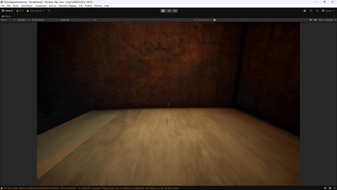
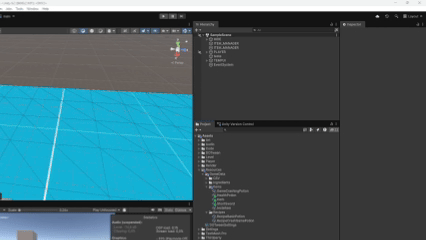
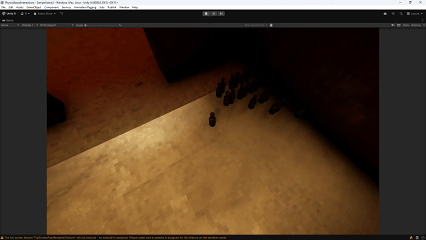

# Rafael Roth – Game Development Portfolio

Welcome to my portfolio.  
Here I showcase focused experiments and systems I’ve developed in Unity, mainly around:

- **First Person Controller**
- **CSV → ScriptableObjects Pipelines**
- **Physics & Interactions**

---

## First Person Controller (Unity)

**Tech:** Unity, C#, Input System  
**Features:**
- Smooth physics-based movement  
- Headbob system  
- Smoothed and clamped camera rotation  

[▶ Watch video](https://youtu.be/91tZ-68vI_M?t=5)

---

## CSV → ScriptableObjects Pipeline

**Tech:** Unity, C#, Editor Tools  
An automated workflow that:
- Reads CSV files  
- Converts each row into ScriptableObjects  
- Generates organized item/character/config databases  
- Speeds up balancing and iteration  

[▶ Demo](https://youtu.be/91tZ-68vI_M?t=66)

---

## Physics & Interaction Tests

**Tech:** Unity, C#, Rigidbody/Collider  
Experiments exploring:
- Breakable objects  
- Push/pull interactions  

[▶ Watch](https://youtu.be/91tZ-68vI_M?t=170)

---

## About Me

Game developer in training, focused on:
- Gameplay programming  
- Editor tools  
- Physics & sound systems  
- Unity as my main engine  

Currently seeking a **Development internship**.

---

## Contact

- **GitHub:** https://github.com/RothRafael  
- **Email:** rafaeltroth@gmail.com 

---
